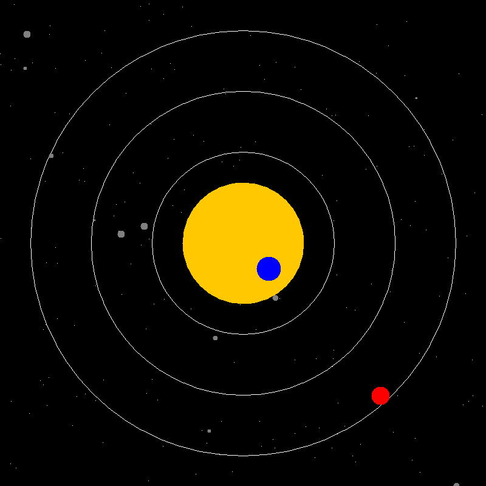

# Solar System Simulator



## Description

The Solar System Simulator is a Java application that generates an image of our solar system with the sun, planets, moons, and orbital rings. You can customize the appearance of celestial objects and add more planets and features to the simulation.

## Installation

1. Clone this repository to your local machine:
git clone https://github.com/your-username/solar-system-simulator.git


2. Ensure you have Java Development Kit (JDK) installed on your system.

3. Open the project in your preferred Java IDE (e.g., IntelliJ IDEA, Eclipse).

4. Run the `DrawSolar` class to generate the solar system image.

## Adding More Planets and Features

To add more planets or features to the solar system simulation, follow these steps:

1. Open the `DrawSolar` class in your IDE.

2. Inside the `main` method, you can create more instances of the `Planet` class to add new planets with their properties. For example, to add a new planet named "Jupiter" with a red color and no moon, you can do the following:

```java
planets.add(new Planet(center, innerRadius, outerRadius, 0, "Jupiter", Color.RED, "", null));
Customize the properties of the planet according to your requirements.

If you want to add a moon to a planet, create a new instance of the Planet class for the moon and specify the planet as the moon's parent. For example, to add a moon named "Ganymede" to Jupiter, you can do the following:

java
planets.add(new Planet(jupiter.getCenter(), 5, 15, 0, "Ganymede", Color.GRAY, "", jupiter));
Run the DrawSolar class to generate the updated solar system image with your new planets and features.

Screenshots
Solar System Screenshot

License
This project is licensed under the MIT License - see the LICENSE.md file for details.
